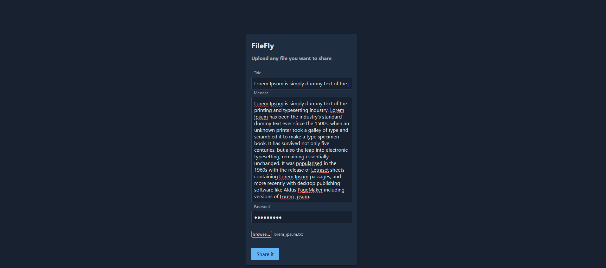
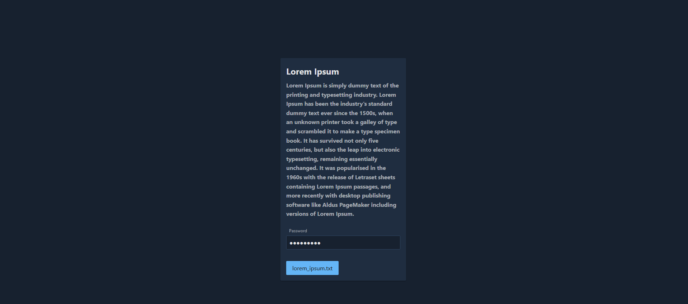

# FileFly Client

This is a Vue.js 3 client that allows you to interact with the Django REST API file transfer server through a
user-friendly interface.

## Features

* Upload and download files through a user-friendly interface.
* Easy to use and configure.

## Usage

1. Install required packages: `npm install`
2. Start the development server: `npm run dev`
3. Open the app in your browser: `http://localhost:8080`

## Screenshots

### Upload page

### Download page

